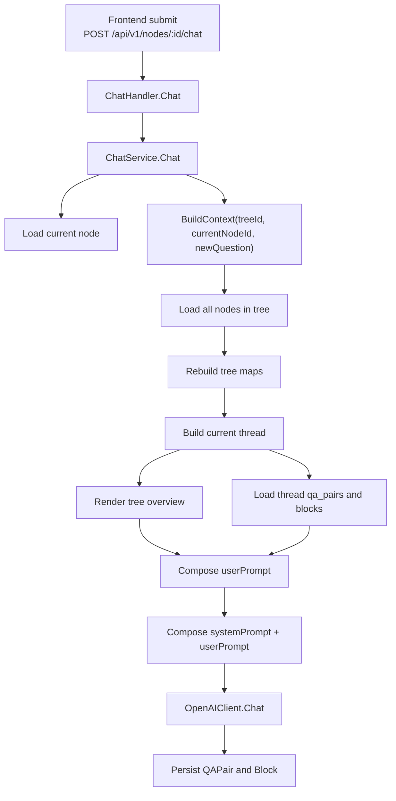

# 当前 AI Context 构建现状

## 背景

本文记录 Cognitree MVP 当前版本中，节点聊天请求的 context 是如何构建的、实际包含哪些信息、缺少哪些信息，以及它与 Thinking Tree 长期目标之间的差距。

本文基于 2026-04-12 的代码现状整理，目的是为后续的 context 重构、summary 接入、anchor 语义增强和 token budget 设计提供基线。

## 一句话结论

当前实现采用的是：

> 全树结构概览 + 当前路径全量问答历史 + 当前问题

它已经不再是纯线性聊天历史，但本质上仍然是一次性的 prompt 拼装，还没有演进到“基于知识树的分层上下文构建”。

## 触发链路

用户在前端工作区继续提问时，完整链路如下：

1. 前端调用 `POST /api/v1/nodes/:id/chat`
2. `ChatHandler.Chat` 接收请求
3. `ChatService.Chat` 根据 `nodeId` 获取当前节点
4. `ContextBuilder.BuildContext(treeID, currentNodeID, newQuestion)` 构建上下文
5. `OpenAIClient.Chat(systemPrompt, userPrompt)` 调用模型
6. 回答落库为 `QAPair + Block`

关键代码位置：

- `frontend/src/api/chat.ts`
- `frontend/src/components/workspace/WorkspacePanel.tsx`
- `backend/internal/interfaces/http/handler/chat.go`
- `backend/internal/application/service/chat_service.go`
- `backend/internal/infrastructure/ai/context_builder.go`
- `backend/internal/infrastructure/ai/openai_client.go`

## 流程图

## 当前实现的详细构建过程

### 1. 前端只传当前问题，不传上下文

前端聊天接口非常薄，只发送：

- `nodeId`
- `question`

前端不会自行拼接聊天历史，也不会把树结构、thread、anchor、summary 一并传给后端。context 完全由后端现算。

### 2. 后端先定位当前节点

`ChatService.Chat` 会先通过 `nodeRepo.GetByID(nodeID)` 取到当前节点，拿到：

- `TreeID`
- 当前 `nodeId`
- 本次新问题 `req.Question`

然后把这三个量交给 `BuildContext`。

### 3. BuildContext 一次性加载整棵树的所有节点

`context_builder.go` 中首先执行：

- `nodeRepo.GetByTreeID(ctx, treeID)`

随后在内存中重建：

- `nodeMap`
- `childrenMap`
- `rootNode`

也就是说，当前版本的 context 构建入口是“全树收集”，而不是“按相关性检索”或“按 token 预算筛选”。

### 4. 构造当前探索路径

`buildThread()` 会从当前节点一路向上追溯到根节点，得到：

- 根节点
- 父节点
- 当前节点

组成的路径列表。

这是当前实现里最重要的一条语义主线，因为只有这条路径上的节点会被展开成完整问答历史。

### 5. 构造全树概览

`renderTreeOverview()` 会递归渲染整棵树，输出每个节点的：

- `question`
- `status`
- 是否为当前节点的标记

这里不会带回答内容，也不会带节点摘要，只是一个“结构级别”的树概览。

### 6. 构造当前路径详情

对 thread 上的每个节点，系统会继续查询：

- `qaPairRepo.GetByNodeID(node.ID)`
- `blockRepo.GetByQAPairID(qaPair.ID)`

最终把当前路径上所有节点的历史问答完整展开进 prompt。

展开粒度是：

- 节点标题
- 每一轮 question
- 每个 answer block 的 `content`

这里是当前 prompt 中信息密度最高的部分。

### 7. 拼装 prompt

最终的 prompt 分为两段：

#### System Prompt

固定写死在 `context_builder.go` 中，核心要求是：

- 围绕当前节点主题回答
- 参考整棵树上下文
- 输出结构清晰的 Markdown
- 适当引导后续可继续深入的方向

#### User Prompt

`userPrompt` 当前固定包含三段：

1. `思维树结构概览`
2. `当前探索路径（从根到当前节点）`
3. `当前问题`

这意味着模型真正看到的是“树结构说明 + 当前路径全量历史 + 本次输入”。

### 8. 模型返回后再落库

`ChatService.Chat` 在拿到模型回答后，才会：

1. 创建新的 `QAPair`
2. 创建新的回答 `Block`
3. 如果节点原本是 `draft`，更新为 `answered`

因此，本次新问题并不是先进入历史，再被模型读取；它只是作为 `userPrompt` 最后一段直接发送给模型。

## 当前 context 实际包含的信息

当前 prompt 中已经包含：

- 整棵树的节点结构
- 每个节点的 `question`
- 每个节点的 `status`
- 当前节点在树中的位置
- 当前路径上的全部历史 QAPair
- 当前路径上每一轮回答的 Block 内容
- 本次最新问题

这使得系统已经具备了比普通 chat history 更强的树状感知能力。

## 当前 context 未包含的信息

以下信息虽然在系统中部分存在，但目前没有进入聊天 prompt：

### 1. 非当前路径分支的回答正文

兄弟节点、叔伯节点、其他远支节点的回答内容不会进入 prompt。

它们只以“节点标题 + 状态”的形式出现在树概览中。

结果是模型知道“树上还有这些分支”，但不知道那些分支已经沉淀了什么知识。

### 2. Anchor 语义

系统支持用户从回答中选中文本，创建带 `quoted_text` 的子问题。

但当前聊天时并不会读取：

- `anchor`
- `quoted_text`
- 引文在父回答中的位置

所以 child node 在继续提问时，模型并不知道“这个子问题是从父回答的哪一段展开出来的”。

### 3. Summary

数据库层已经有 `Summary` model，但当前聊天链路完全没有接入 summary。

这意味着：

- 没有节点摘要
- 没有子树摘要
- 没有远距离历史压缩

因此树一变大，就只能继续依赖原始问答全文。

### 4. Tree 级目标信息

`Tree` 实体包含：

- `Title`
- `Description`

但 `BuildContext` 不依赖 `treeRepo`，所以树级元信息不会进入 prompt。

模型当前只能看到节点问题，无法显式看到这棵树的全局目标描述。

### 5. Token Budget 与筛选策略

当前没有：

- relevance ranking
- token budget
- priority selection
- retrieval
- summarization fallback

因此 context 的增长方式基本是线性的。

## 当前设计的直接后果

### 优点

- 相比纯线性 chat history，更符合 Thinking Tree 的交互形态
- 已经具备“整棵树感知 + 当前路径深挖”的基本能力
- 实现简单，MVP 阶段成本低

### 局限

- 树越大，prompt 越容易膨胀
- 其他分支知识无法被有效复用
- anchor 失去语义锚点作用，只剩下创建子节点的功能
- summary 体系未启用，无法把提问历史沉淀为稳定知识
- 没有 context selection，容易重新遇到 context noise 和 context window limit

## 与 Thinking Tree 愿景的差距

从项目愿景看，目标是：

> 提问树 -> 知识树 -> 个人知识体系

而当前实现仍然更接近：

> 树形界面上的 prompt 组装器

具体差距主要体现在四点：

### 1. 结构有了，知识沉淀还不够

当前已经有树结构，但知识仍主要保存在原始 QAPair 和 Block 中，没有稳定沉淀为 summary 或知识节点。

### 2. 关联有了，语义还不够深

节点间虽然有 parent-child 关系，也有 anchor 数据，但聊天上下文还没有把“为什么从这里分叉”表达出来。

### 3. 可导航有了，可复用还不够

用户可以在树上跳转，但其他分支的内容无法高质量复用到当前回答。

### 4. 全树感知有了，调度策略还没有

系统已经知道“整棵树长什么样”，但还不会判断“这次应该取哪些内容进上下文”。

## 后续演进建议

建议按以下顺序演进：

### 第一阶段：补语义最强但改动最小的上下文

- 把 `Tree.Title/Description` 接入 prompt
- 把当前节点的 `anchor.quoted_text` 接入 prompt

这样可以先补齐“全局目标”和“分叉依据”。

### 第二阶段：引入 summary 体系

- 节点摘要
- 子树摘要
- 历史问答压缩

这样可以逐步把“提问过程”沉淀为“知识结构”。

### 第三阶段：从全树收集升级为选择式上下文

理想结构可以演进为：

- tree goal
- current path detail
- current node summary
- anchor evidence
- sibling summaries
- relevant remote branches
- current ask

### 第四阶段：加入 token budget 和优先级调度

优先级可以考虑：

1. 当前节点及最近问答
2. 当前 thread
3. 当前节点 anchor
4. 兄弟分支摘要
5. 远支相关节点摘要

## 关键观察

还有两个实现细节值得注意：

### 1. 当前实现会吞掉部分上下文查询错误

在拼接 thread 详情时，如果某个节点的 `qaPairs` 或 `blocks` 查询失败，代码会直接 `continue`，不会中断整个请求。

这意味着模型可能拿到的是“不完整上下文”，但接口层不会显式暴露这个问题。

### 2. 当前实现是一次性二段消息，不保留消息级别结构

发给模型的消息只有两条：

- `system`
- `user`

没有把树、thread、anchor、summary 拆成更细的 message role 或结构化字段。

## 总结

当前版本的 context 构建可以概括为：

> 用整棵树提供结构感，用当前路径提供语义密度，用当前问题触发新一轮探索。

它已经体现了 Thinking Tree 相对于普通 chat 的方向性优势，但还没有完成从“树状对话”到“知识树上下文引擎”的跃迁。

后续如果要继续推进，最关键的不是继续堆更多历史，而是把：

- anchor
- summary
- tree goal
- selection strategy

这四层能力接进 context builder。
